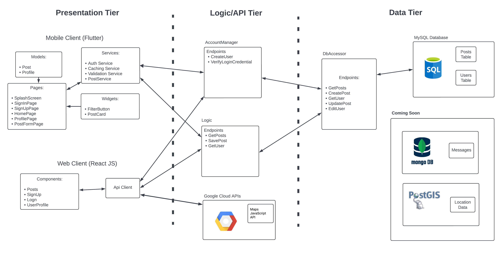
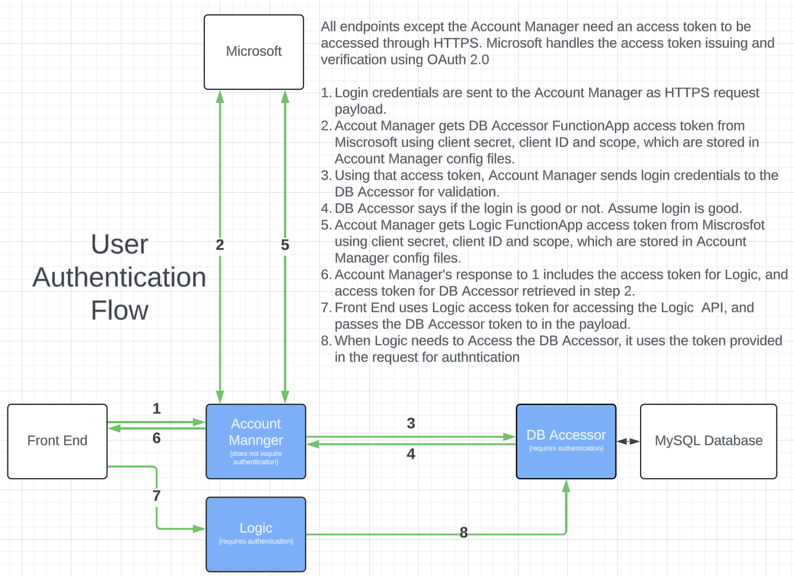
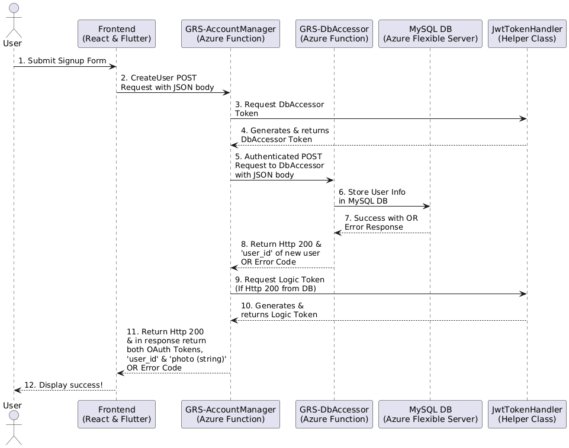
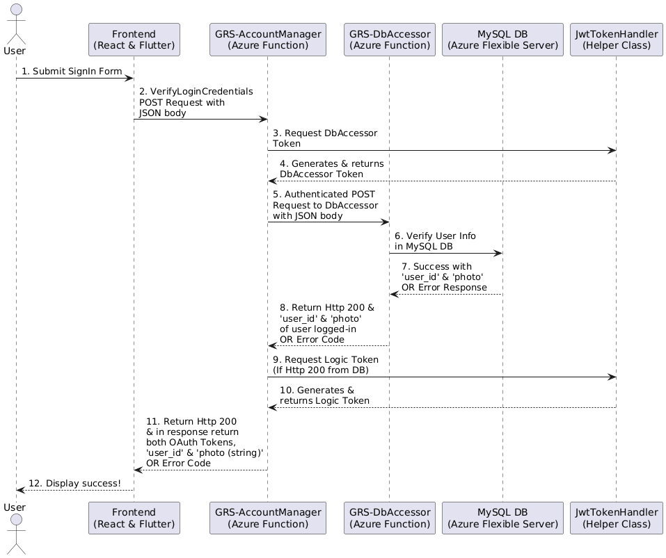
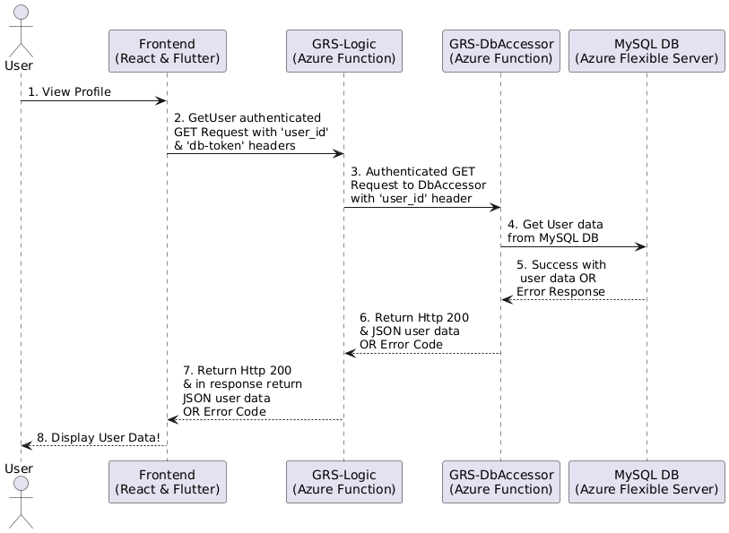
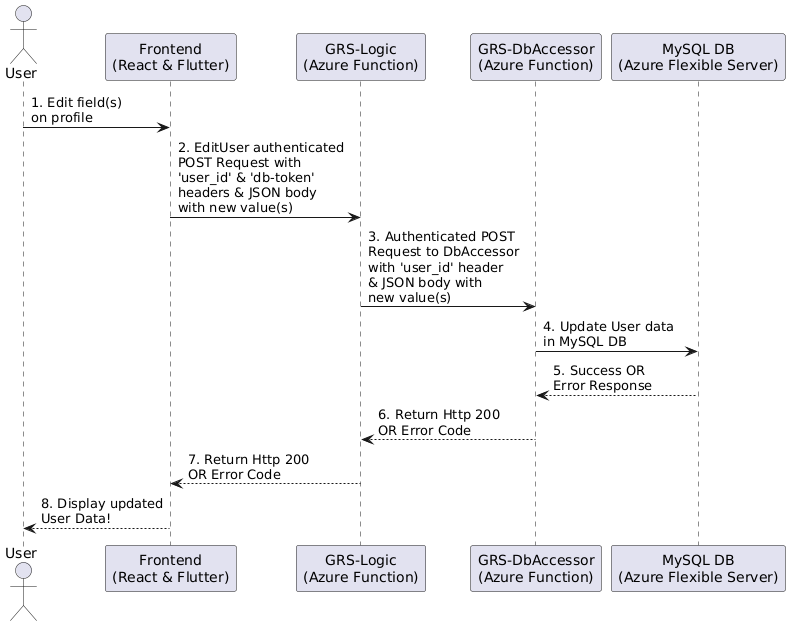
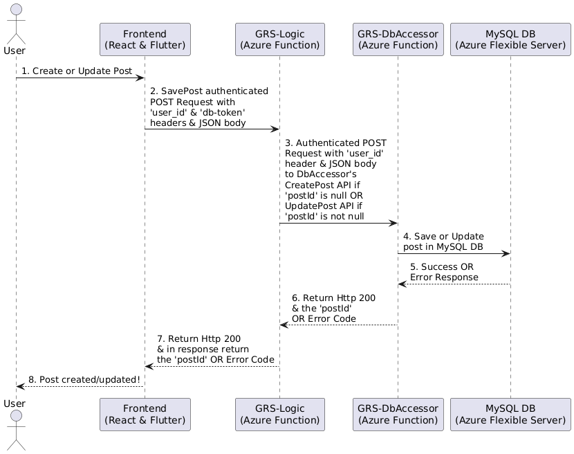
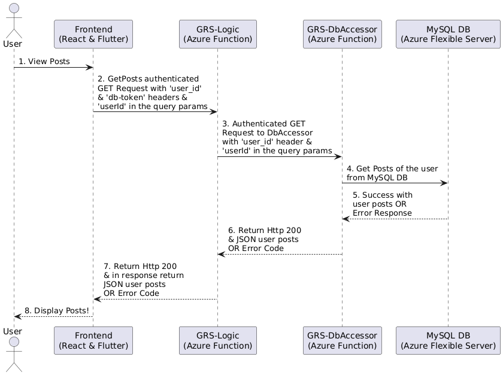

# Go Ride Share

### Endpoint Documentation
- Each set of endpoints has its own `Endpoints.yaml` file describing endpoints
- The "Swagger Viewer" extension on VScode is an easy way to render these documents

## Architecture Diagrams


## How to run locally (Developer Guide)

#### DB Layer
- **NOTE:** You need to install Azure Functions Core Tools v4
   - This can be done on mac using the following brew commands:
     ```
     brew tap azure/functions
     brew install azure-functions-core-tools@4
     ```
   - Or on windows using [Azure Tools](https://learn.microsoft.com/en-us/azure/azure-functions/functions-run-local?tabs=windows%2Cisolated-process%2Cnode-v4%2Cpython-v2%2Chttp-trigger%2Ccontainer-apps&pivots=programming-language-csharp#install-the-azure-functions-core-tools:~:text=quickstart%20article.-,Install%20the%20Azure%20Functions%20Core%20Tools,-The%20recommended%20way). Installation might need system restart.
- Modify `sample.local.settings.json` to be `local.settings.json` in **db-layer/DbAccessor** and update the values to the following:
```
"DB_CONNECTION_STRING": "Server=\"test-data.mysql.database.azure.com\"; port=\"3306\";UserID=\"testadmin\";Password=\"Dbsofteng2\";Database=\"go-ride-share\";"
```
-  In terminal navigate to `db-layer/DbAccessor/` then run `func start -p 7073`

#### Logic Layer 1 (AccountManager)
- Open logic-layer repo and navigate to AccountManager directory.
- Rename file `sample.local.settings.json` to `local.settings.json`
- In terminal, navigate to directory `logic-layer/AccountManager/` then run `func start -p 7071`

#### Logic Layer 2 (Logic)

- Open logic-layer repo, in terminal navigate to  `logic-layer/Logic/` then run `func start -p 7072`

#### React Front End
- run `npm install` to install all dependancies
- In `.env` add:
```
   REACT_APP_API_AUTH_URL=http://localhost:7071/api
   REACT_APP_API_BASE_URL=http://localhost:7072/api
```
- `npm start`
- The website will open in your browser

#### Flutter Front End (Android Mobile App)
- Requirement: Ensure you have launched an Android emulator or connected a physical device
   - Option 1: Start the emulator from command line ([see installation instructions](https://developer.android.com/studio/run/emulator-commandline)) 

      You can run `flutter emulators` to see a list of available emulators, then run `flutter emulators --launch <emulator_name>` to start an emulator.

      OR, neat VSCode trick: CTRL+SHIFT+P, type "Select Devices" and select the emulator you want to launch.   
      
   - Option 2: Launch Android studio and use its existing emulator. 
    
      In device manager, click green "Play" button to start an emulator (tip: if this doesn’t work, try cold booting).

      If you do not have Android studio installed, [see installation instructions](https://developer.android.com/studio).

- Install Flutter on your machine
   - MacOS: Use Homebrew in terminal, run `brew install --cask flutter`
   - Windows: [installation instructions](https://docs.flutter.dev/get-started/install/windows/mobile#install-the-flutter-sdk)

- Open the repo, uncomment the following lines in `mobile-client/lib/constants.dart` to run the app locally. **Be sure to comment out the same variables below in the file to prevent errors:**

      REACT_APP_API_AUTH_URL=http://localhost:7071/api
      REACT_APP_API_BASE_URL=http://localhost:7072/api

 - Then navigate to root directory `mobile-client` and run `flutter run`

## Authentication Flow
This diagram explains how the system handles user authentication, and how access to the logic and database is given to the user.


## Sequence Diagrams






