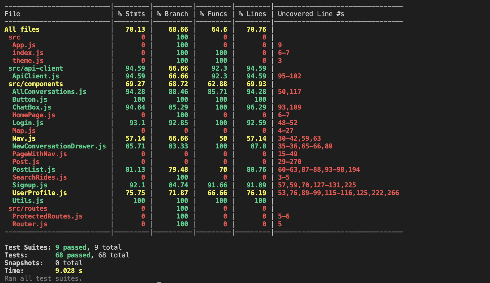
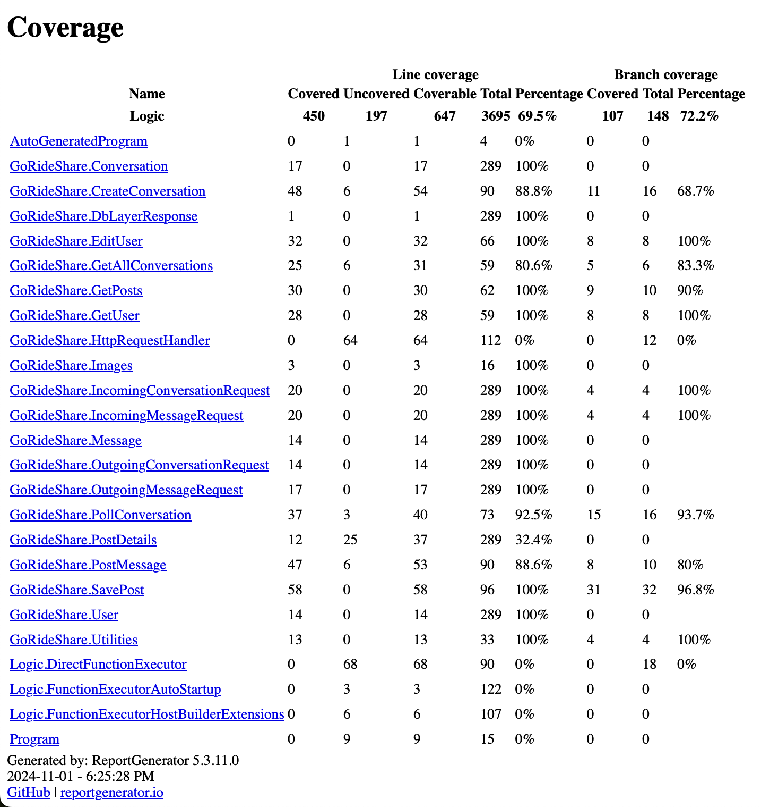

# Sprint 2 Worksheet
### [Meeting Minutes]()

## Regression Testing

## Testing Slowdown
We have one test plan for each of the layers and have been able to test all unit tests and integration tests as it did not slow down our CI/CD pipeline significantly enough for that to be necessary.

## Not Testing
Testing coverage for each tier:
- Presentation Tier:
  - Mobile UI: 
    - Models Layer, Pages Layer, Services Layer, and Widgets Layer: not tested (as we have a very thin client for the mobile UI)
  - Web UI: 
    - Components Layer: fully tested
    - API Layer: fully tested
- Logic Layer Tier: 
  - Account Manager Layer: fully tested
  - Logic Layer: fully tested
  - Google Cloud API Layer: no tests
- Database Tier: no tests

Coverage report for Web UI tier:

Coverage report for logic tier:

## Profiler

[Profile Result](https://github.com/Go-Ride-Share/.github/blob/main/profiler_result.md)

The slowest endpoint is GetAllPosts, with an average response time of 576 ms. This endpoint is slow because it retrieves all records from the posts table at once, which can result in large data transfers and slower response times, especially as data grows.

A potential fix is implementing pagination in the query. This would allow the endpoint to retrieve a smaller subset of posts per request, reducing load on the database and improving response time. Implementing pagination will also help maintain performance as the data volume grows.
Profiler Result

## Last Dash

In the final sprint, We foresee the following potential issues:

 - Security Risks with User Tokens and IDs: Currently, the system relies on user IDs and tokens for access control. If a user ID is compromised, it may allow unauthorized access to other users' data. This is a critical security issue, as sensitive information could be accessed without proper authorization. To mitigate this risk, we should consider implementing additional security measures such as token validation to ensure it matches the authenticated user.
 - Another issue is the complexity of the multi-city search feature. When users request routes (e.g., from Winnipeg to Calgary), the current design only stores latitude and longitude coordinates. Running queries based on these geographic points to determine viable routes will be challenging, especially if we need to filter results efficiently for large datasets.

## Show Off

### Muhammad
I focused on the web UI this sprint, specifically building out the messaging feature. Users can now open a responsive drawer to view all their conversations. When a conversation is selected, a chat window opens where they can send and receive messages seamlessly. The UI is designed to be clean and user-friendly, offering an engaging experience. Overall, I’m really proud of how intuitive and polished this feature turned out!
[UI Snapshots](https://github.com/Go-Ride-Share/.github/tree/main/sprint_2_images)

### Asit

### Ben

### Bilal
I focused on the mobile UI this sprint and built out the UI for the messaging feature. Mobile users can now see other users' posts, contact other users, and send them messages directly, as well as see the conversation they've had/are having in a clean inbox. I don't have much experience using Flutter so I'm particularly proud of how this feature has turned out. 

### Dhairya

### Eddie
