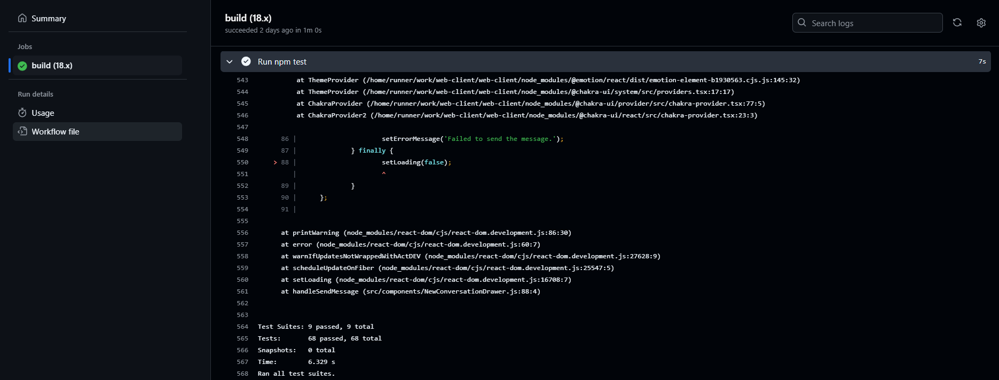
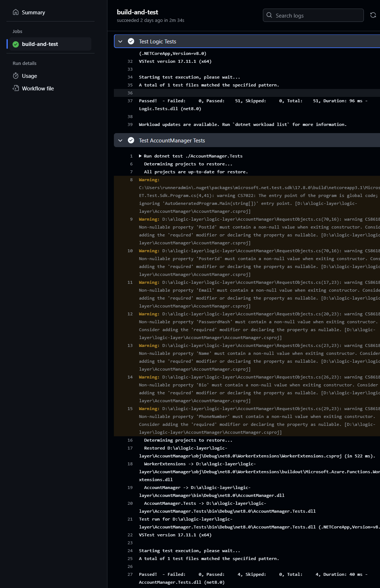

# Sprint 2 Worksheet
### [Meeting Minutes]()

## Regression Testing
Regression tests are being run (via npm test) for all tests in the web-client and (via dotnet test) for all tests in the logic-layer, and done so as part of our CI/CD pipeline for every merge and pull requests to dev and main branches (aside from the mobile-client and db-layer repos, which do not contain tests). 

Web Client (web-client repo): 
- Link to regression testing script: https://github.com/Go-Ride-Share/web-client/blob/main/.github/workflows/node.js.yml 
- Last screenshot/results of execution (Link: https://github.com/Go-Ride-Share/web-client/actions/runs/11658891347/job/32458605796 ), Screenshot:

Logic (logic-layer repo):
- Link to regression testing script: https://github.com/Go-Ride-Share/logic-layer/blob/main/.github/workflows/tests.yml
- Last screenshot/results of execution for Logic Layer repo (Link: https://github.com/Go-Ride-Share/logic-layer/actions/runs/11669771304), Screenshot:

## Testing Slowdown
We have one test plan for each of the layers and have been able to test all unit tests and integration tests as it did not slow down our CI/CD pipeline significantly enough for that to be necessary.

## Not Testing
Testing coverage for each tier:
- Presentation Tier:
  - Mobile UI: 
    - Models Layer, Pages Layer, Services Layer, and Widgets Layer: not tested (as we have a very thin client for the mobile UI)
  - Web UI: 
    - Components Layer: fully tested
    - API Layer: fully tested
- Logic Layer Tier: 
  - Account Manager Layer: fully tested
  - Logic Layer: fully tested
  - Google Cloud API Layer: no tests
- Database Tier: no tests

Coverage report for Web UI tier:

Coverage report for logic tier:

## Profiler

[Profile Result](https://github.com/Go-Ride-Share/.github/blob/main/profiler_result.md)

The slowest endpoint is GetAllPosts, with an average response time of 576 ms. This endpoint is slow because it retrieves all records from the posts table at once, which can result in large data transfers and slower response times, especially as data grows.

A potential fix is implementing pagination in the query. This would allow the endpoint to retrieve a smaller subset of posts per request, reducing load on the database and improving response time. Implementing pagination will also help maintain performance as the data volume grows.
Profiler Result

## Last Dash

In the final sprint, We foresee the following potential issues:

 - Security Risks with User Tokens and IDs: Currently, the system relies on user IDs and tokens for access control. If a user ID is compromised, it may allow unauthorized access to other users' data. This is a critical security issue, as sensitive information could be accessed without proper authorization. To mitigate this risk, we should consider implementing additional security measures such as token validation to ensure it matches the authenticated user.
 - Another issue is the complexity of the multi-city search feature. When users request routes (e.g., from Winnipeg to Calgary), the current design only stores latitude and longitude coordinates. Running queries based on these geographic points to determine viable routes will be challenging, especially if we need to filter results efficiently for large datasets.

## Show Off

### Muhammad
I focused on the web UI this sprint, specifically building out the messaging feature. Users can now open a responsive drawer to view all their conversations. When a conversation is selected, a chat window opens where they can send and receive messages seamlessly. The UI is designed to be clean and user-friendly, offering an engaging experience. Overall, I’m really proud of how intuitive and polished this feature turned out!
[UI Snapshots](https://github.com/Go-Ride-Share/.github/tree/main/sprint_2_images)

### Asit

### Ben
For this sprint I set up dummy endpoints on the logic layer in the first week of the sprint, allowing for the UI to be developt against these endpoints [(PR link)](https://github.com/Go-Ride-Share/logic-layer/pull/43). This created consistent object definitions that could be referenced when creating the DB layer responses.
Then, near the end of the sprint I spent some time cleaning up the DB layer, improving validation, error messages and code quality [(PR link)](https://github.com/Go-Ride-Share/db-layer/pull/46).

### Bilal
I focused on the mobile UI this sprint and built out the UI for the messaging feature. Mobile users can now see other users' posts, contact other users, and send them messages directly, as well as see the conversation they've had/are having in a clean inbox. I don't have much experience using Flutter so I'm particularly proud of how this feature has turned out. 

### Dhairya
I focused on setting up Docker for creating local database containers that connects to our app for local testing and development, and configured a continuous deployment pipeline that pushes the latest image to Docker Hub on every `main` branch release. Additionally, I implemented a regression testing pipeline that runs for every `pull request` to `dev` and `main`, ensuring functional testing.

### Eddie
This sprint, the work I did on mobile is what makes me the most proud. I was really happy I could get the app running on my physical iPhone, but this wasnt the biggest accomplishment. My job was to connect the mobile ui to the logic through real HTTP requests (it was using local dummy data previously). With no real dart experience and not working with anything on the mobile side previously, I was able to find my away arround the project, implement all the endpoint and even reduce code duplication. [This commit](https://github.com/Go-Ride-Share/mobile-client/commit/a68756cf8dac831ad1b1b19349ecc737d582446d#diff-ba7b002fad5d86a33014db433cb39e04c4f096cae0cac84d2469c55f7da85ffa) is when I first created the file that contains commonly used operations, but it evolved with subsequent commits. It's not a lot of code, and its not complicated code, by I am proud that I was able to think of abstract CS concepts in a project I was not familiar with written in a language I was not familiar with.
