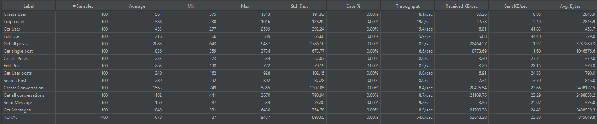
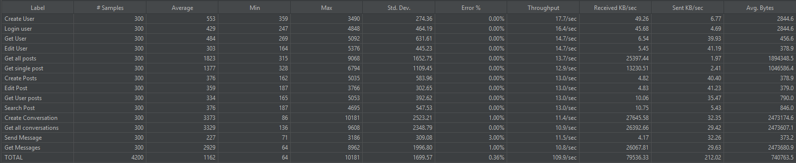

# Sprint 3 Worksheet

## Load Testing
### Testing Tool
For our load testing, we have used **Apache JMeter**. This allowed us to simualte high numbers of concurrent users and effectively gauge the performance and scalability of our API under simulated real-world conditions.

### Test Cases
Our testing was structured to gradually increase the load, allowing us to monitor how the system scaled and how performance metrics changed with increased user activity. Here’s a detailed look at our phased testing approach:

1. **Phase 1: Testing with 100 Users**
    - **Objective:** Initially, we tested all endpoints with 100 concurrent users to establish a performance baseline and identify any immediate bottlenecks.
    - **Endpoints:** All of the endpoints of the entire project were tested with 100 concurrent requests.
    - **Duration:** Instantaneous spike to 100 users to simulate peak immediate load without ramp-up.

2. **Phase 2: Testing with 300 Users**
    - **Objective:** After establishing a baseline, we scaled the number of concurrent users to 300, distributed over a period of 5 seconds to test the system’s capacity to handle a rapid increase in load.
    - **Endpoints:** All of the endpoints of the entire project were tested with 300 requests over a period of 5 seconds.
    - **Duration:** Users were added gradually over 5 seconds to simulate a more realistic ramp-up in user traffic.

### Results and Observations

1. **Phase 1 Test Results:**
    - The system performed robustly with 100 concurrent users, maintaining responsiveness and stability across all functionalities of the app.
    - Error Rate: 0%, indicating that the system could handle initial peak loads efficiently.

  

2. **Phase 2 Test Results:**
    - The system showed robust performance across most functionalities of the app, handling the increased load of 300 concurrent users effectively.
    - Error Rate: While the majority of the functionalities maintained a 0% error rate, there were exceptions in specific areas, i.e. Create Conversation, Send Message, and Get Messages.

  

- **Responsiveness and Stability:** Despite the higher user load, the system maintained good responsiveness for most endpoints. However, the variance in error rates across different functionalities suggests that while the system is largely stable, there are isolated issues that need addressing.
- **Performance Metrics:** Throughput was consistent across most endpoints, indicating the application's ability to handle multiple simultaneous operations. Response Times varied, with some endpointa showing longer times, suggesting areas for optimization. Error Rates were generally low but noticeable in operations involving messaging.
- **Key Bottleneck Found:** The endpoints related to messaging ('Create Conversation', 'Send Message', and 'Get Messages') displayed higher error rates and longer response times. This was due to insufficient server resources to handle these specific tasks.

### Discussion of Non-Functional Requirements
- The primary goals of ensuring that the system remains responsive and stable under high load were partially met. While the application handled basic functionalities like user creation and login very well, there were challenges with messaging-related features under peak loads.
- The system demonstrated strong performance for straightforward CRUD operations, maintaining good throughput and low error rates. Although, higher error rates and response times in messaging functionalities indicate that the system’s current resource allocation may not adequately support more complex interactions under stress with more than 100 concurrent users.
- If we consider using financial resources to meet the performance goals that were not initially met during load testing could likely mitigate the identified bottlenecks, i.e. Database optimization, investing in better database management solutions that supports over thousands requests per second, would optimize database operations, ensuring robust scalability.

[JMX](https://github.com/Go-Ride-Share/.github/blob/main/Go-Ride-Share-Load-test.jmx) file for Go Ride Share Load Test

## Security Analysis

## Continuous Integration and deployment (CI/CD)

We have used GitHub Actions to handle integration and deployment tasks for all of our components: the web client, database layer, account manager, and logic layer. 
We have demonstrated the prod enviornment's CI/CD workflow below. However, we have seperate CI/CD pipeline for the dev environment which works similarly.

### Continuous Integration (CI) Testing Workflow

1. **Pre-Merge Checks**:
   - Upon creating a pull request (PR), the CI pipeline automatically triggers.
   - Unit and integration tests are executed.
   - Merging is blocked unless all tests pass successfully.
   - We must resolve any test failures before merging the PR.

2. **Post-Merge Testing**:
   - Once changes are merged into the main branch, CI runs all tests again.
   - This ensures main branch stability and uncovers potential integration issues.

### Continuous Deployment (CD) Workflow

- **Web Client**:  
  CI/CD pipeline deploys the web client via an Azure Static Web Apps action upon successful changes to the `main` branch.  
  - Link to Web Workflow: [Azure Static Web Apps Workflow](https://github.com/Go-Ride-Share/web-client/blob/main/.github/workflows/azure-static-web-apps-black-rock-0cc860b0f.yml)

- **Database Layer**:  
  Updates to the `DbAccessor` directory trigger the deployment of Azure Functions for database interaction.  
  - Link to DB Workflow: [DbAccessor Workflow](https://github.com/Go-Ride-Share/db-layer/blob/main/.github/workflows/main_grs-dbaccessor.yml)

- **Account Manager**:  
  Changes to the `AccountManager` directory initiate CI/CD for managing user accounts through Azure Functions.  
  - Link to Account Manager Workflow: [AccountManager Workflow](https://github.com/Go-Ride-Share/logic-layer/blob/main/.github/workflows/main_grs-accountmanager.yml)

- **Logic Layer**:  
  Business logic is automatically deployed via Azure Functions when changes are made to the `Logic` repo.  
  - Link to Logic Workflow: [Logic Workflow](https://github.com/Go-Ride-Share/logic-layer/blob/main/.github/workflows/main_grs-logic.yml)

### Snapshots of Execution

- **Web Continuous Integration**:  
  

- **Web Continuous Deployment**:  
  

## Thoughts

## Other thoughts
